# Diploma TensorBoard summary

### Overall

**Beauty**
| variant     | ndcg@5         | ndcg@10        | ndcg@20        | recall@5       | recall@10      | recall@20     |
|-------------|----------------|----------------|----------------|----------------|----------------|---------------|
| baseline    | 0.02689        | 0.03412        | 0.04034        | 0.04083        | 0.06332        | 0.0889        |
| tuned, 0.07 | <u>0.03041</u> | <u>0.03839</u> | <u>0.04703</u> | <u>0.04655</u> | <u>0.07164</u> | <u>0.1061</u> |
| logQ        | **0.0318**     | **0.03968**    | **0.04827**    | **0.0487**     | **0.07293**    | **0.1071**    |

**VK-small**
| variant     | ndcg@5         | ndcg@10        | ndcg@20        | recall@5       | recall@10     | recall@20     |
|-------------|----------------|----------------|----------------|----------------|---------------|---------------|
| baseline    | <u>0.06223</u> | <u>0.07821</u> | <u>0.09503</u> | <u>0.09412</u> | <u>0.1438</u> | <u>0.2108</u> |
| tuned, 0.07 | **0.06436**    | **0.07998**    | **0.097**      | **0.09681**    | **0.1452**    | **0.213**     |
| logQ        | 0.06196        | 0.07689        | 0.09307        | 0.09308        | 0.1419        | 0.2057        |

**Yambda**
| variant     | ndcg@5         | ndcg@10        | ndcg@20        | recall@5      | recall@10      | recall@20      |
|-------------|----------------|----------------|----------------|---------------|----------------|----------------|
| baseline    | 0.01251        | 0.01595        | <u>0.02042</u> | 0.0196        | 0.03166        | <u>0.04975</u> |
| tuned, 0.07 | **0.01331**    | <u>0.01667</u> | **0.02109**    | **0.02141**   | **0.03272**    | **0.0502**     |
| logQ        | <u>0.01257</u> | **0.01675**    | 0.02042        | <u>0.0202</u> | <u>0.03211</u> | 0.04809        |

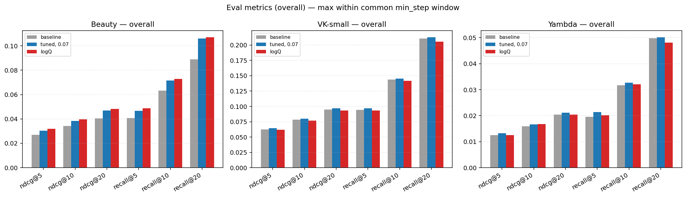

### Cold items

**Beauty**
| variant     | ndcg@5         | ndcg@10        | ndcg@20        | recall@5       | recall@10      | recall@20      |
|-------------|----------------|----------------|----------------|----------------|----------------|----------------|
| baseline    | 0.00904        | 0.01066        | 0.01311        | 0.01263        | 0.01779        | 0.02811        |
| tuned, 0.07 | <u>0.01061</u> | <u>0.01299</u> | <u>0.01663</u> | <u>0.01583</u> | <u>0.02331</u> | <u>0.03789</u> |
| logQ        | **0.01217**    | **0.01556**    | **0.01953**    | **0.01779**    | **0.02864**    | **0.0443**     |

**VK-small**
| variant     | ndcg@5          | ndcg@10         | ndcg@20         | recall@5        | recall@10       | recall@20      |
|-------------|-----------------|-----------------|-----------------|-----------------|-----------------|----------------|
| baseline    | <u>0.002747</u> | <u>0.003726</u> | <u>0.005415</u> | <u>0.005226</u> | <u>0.009222</u> | <u>0.01599</u> |
| tuned, 0.07 | 0.002091        | 0.003072        | 0.004735        | 0.003996        | 0.00707         | 0.01383        |
| logQ        | **0.002957**    | **0.004817**    | **0.00688**     | **0.005533**    | **0.01137**     | **0.02029**    |

**Yambda**
| variant     | ndcg@5          | ndcg@10         | ndcg@20         | recall@5        | recall@10       | recall@20     |
|-------------|-----------------|-----------------|-----------------|-----------------|-----------------|---------------|
| baseline    | **0.002379**    | **0.003076**    | **0.004131**    | **0.003885**    | **0.008547**    | **0.01321**   |
| tuned, 0.07 | 0.0015          | <u>0.002074</u> | <u>0.003315</u> | <u>0.002331</u> | <u>0.005439</u> | 0.009324      |
| logQ        | <u>0.001656</u> | 0.002026        | 0.00324         | 0.002331        | 0.005439        | <u>0.0101</u> |

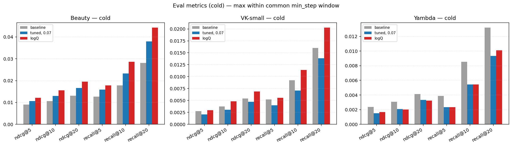

### Warm items

**Beauty**
| variant     | ndcg@5         | ndcg@10        | ndcg@20       | recall@5       | recall@10      | recall@20      |
|-------------|----------------|----------------|---------------|----------------|----------------|----------------|
| baseline    | 0.01263        | 0.01497        | 0.01808       | 0.01789        | 0.02541        | 0.03862        |
| tuned, 0.07 | <u>0.01391</u> | <u>0.01733</u> | <u>0.0224</u> | <u>0.02063</u> | <u>0.03151</u> | <u>0.05204</u> |
| logQ        | **0.01588**    | **0.01993**    | **0.02453**   | **0.02246**    | **0.03608**    | **0.0561**     |

**VK-small**
| variant     | ndcg@5         | ndcg@10         | ndcg@20         | recall@5        | recall@10      | recall@20      |
|-------------|----------------|-----------------|-----------------|-----------------|----------------|----------------|
| baseline    | <u>0.00391</u> | **0.006013**    | <u>0.008409</u> | **0.006745**    | **0.01305**    | <u>0.02317</u> |
| tuned, 0.07 | 0.003864       | <u>0.005791</u> | 0.008327        | 0.006452        | 0.01246        | 0.02258        |
| logQ        | **0.003924**   | 0.005719        | **0.008667**    | <u>0.006598</u> | <u>0.01261</u> | **0.02566**    |

**Yambda**
| variant     | ndcg@5          | ndcg@10         | ndcg@20         | recall@5        | recall@10       | recall@20     |
|-------------|-----------------|-----------------|-----------------|-----------------|-----------------|---------------|
| baseline    | <u>0.002961</u> | 0.003431        | 0.0048          | 0.00443         | **0.008458**    | <u>0.0141</u> |
| tuned, 0.07 | 0.002647        | <u>0.003646</u> | <u>0.005158</u> | <u>0.004833</u> | <u>0.008055</u> | 0.0141        |
| logQ        | **0.003392**    | **0.004162**    | **0.006**       | **0.005236**    | 0.007652        | **0.01611**   |

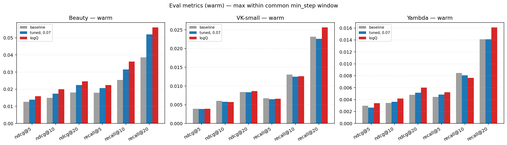

### Hot items

**Beauty**
| variant     | ndcg@5         | ndcg@10        | ndcg@20        | recall@5       | recall@10      | recall@20     |
|-------------|----------------|----------------|----------------|----------------|----------------|---------------|
| baseline    | 0.03204        | 0.04061        | 0.04813        | 0.04858        | 0.07527        | 0.1062        |
| tuned, 0.07 | <u>0.03647</u> | <u>0.04592</u> | <u>0.05618</u> | <u>0.05565</u> | <u>0.08521</u> | <u>0.1267</u> |
| logQ        | **0.03801**    | **0.04724**    | **0.05736**    | **0.05809**    | **0.08656**    | **0.1268**    |

**VK-small**
| variant     | ndcg@5         | ndcg@10        | ndcg@20        | recall@5       | recall@10     | recall@20     |
|-------------|----------------|----------------|----------------|----------------|---------------|---------------|
| baseline    | <u>0.06504</u> | <u>0.08174</u> | <u>0.09932</u> | <u>0.09838</u> | <u>0.1503</u> | <u>0.2203</u> |
| tuned, 0.07 | **0.06727**    | **0.08359**    | **0.1014**     | **0.1012**     | **0.1518**    | **0.2225**    |
| logQ        | 0.06476        | 0.08036        | 0.09725        | 0.09728        | 0.1482        | 0.2149        |

**Yambda**
| variant     | ndcg@5         | ndcg@10        | ndcg@20       | recall@5       | recall@10      | recall@20      |
|-------------|----------------|----------------|---------------|----------------|----------------|----------------|
| baseline    | 0.01335        | 0.01703        | <u>0.0218</u> | 0.02092        | 0.0338         | <u>0.05311</u> |
| tuned, 0.07 | **0.01421**    | <u>0.01779</u> | **0.02246**   | **0.02269**    | **0.03477**    | **0.05344**    |
| logQ        | <u>0.01342</u> | **0.01788**    | 0.02175       | <u>0.02157</u> | <u>0.03428</u> | 0.05134        |

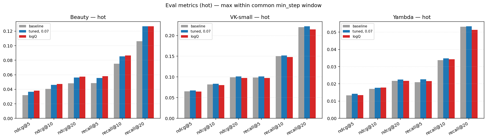

## Uplift vs baseline — per segment

### Improvements over baseline — Overall

**Beauty**
| variant     | metric    |   baseline |   value |   abs_uplift | rel_uplift_%   |
|-------------|-----------|------------|---------|--------------|----------------|
| tuned, 0.07 | ndcg@5    |    0.02689 | 0.03041 |     0.003519 | +13.08%        |
| tuned, 0.07 | ndcg@10   |    0.03412 | 0.03839 |     0.004269 | +12.51%        |
| tuned, 0.07 | ndcg@20   |    0.04034 | 0.04703 |     0.006683 | +16.56%        |
| tuned, 0.07 | recall@5  |    0.04083 | 0.04655 |     0.005724 | +14.02%        |
| tuned, 0.07 | recall@10 |    0.06332 | 0.07164 |     0.008317 | +13.14%        |
| tuned, 0.07 | recall@20 |    0.0889  | 0.1061  |     0.01717  | +19.32%        |
| logQ        | ndcg@5    |    0.02689 | 0.0318  |     0.004906 | +18.24%        |
| logQ        | ndcg@10   |    0.03412 | 0.03968 |     0.005561 | +16.30%        |
| logQ        | ndcg@20   |    0.04034 | 0.04827 |     0.007922 | +19.63%        |
| logQ        | recall@5  |    0.04083 | 0.0487  |     0.00787  | +19.28%        |
| logQ        | recall@10 |    0.06332 | 0.07293 |     0.009614 | +15.18%        |
| logQ        | recall@20 |    0.0889  | 0.1071  |     0.0182   | +20.47%        |

**VK-small**
| variant     | metric    |   baseline |   value |   abs_uplift | rel_uplift_%   |
|-------------|-----------|------------|---------|--------------|----------------|
| tuned, 0.07 | ndcg@5    |    0.06223 | 0.06436 |    0.002129  | +3.42%         |
| tuned, 0.07 | ndcg@10   |    0.07821 | 0.07998 |    0.001767  | +2.26%         |
| tuned, 0.07 | ndcg@20   |    0.09503 | 0.097   |    0.001966  | +2.07%         |
| tuned, 0.07 | recall@5  |    0.09412 | 0.09681 |    0.002686  | +2.85%         |
| tuned, 0.07 | recall@10 |    0.1438  | 0.1452  |    0.001456  | +1.01%         |
| tuned, 0.07 | recall@20 |    0.2108  | 0.213   |    0.002133  | +1.01%         |
| logQ        | ndcg@5    |    0.06223 | 0.06196 |   -0.0002701 | -0.43%         |
| logQ        | ndcg@10   |    0.07821 | 0.07689 |   -0.001322  | -1.69%         |
| logQ        | ndcg@20   |    0.09503 | 0.09307 |   -0.001959  | -2.06%         |
| logQ        | recall@5  |    0.09412 | 0.09308 |   -0.001046  | -1.11%         |
| logQ        | recall@10 |    0.1438  | 0.1419  |   -0.001907  | -1.33%         |
| logQ        | recall@20 |    0.2108  | 0.2057  |   -0.005085  | -2.41%         |

**Yambda**
| variant     | metric    |   baseline |   value |   abs_uplift | rel_uplift_%   |
|-------------|-----------|------------|---------|--------------|----------------|
| tuned, 0.07 | ndcg@5    |    0.01251 | 0.01331 |    0.0008077 | +6.46%         |
| tuned, 0.07 | ndcg@10   |    0.01595 | 0.01667 |    0.0007244 | +4.54%         |
| tuned, 0.07 | ndcg@20   |    0.02042 | 0.02109 |    0.0006715 | +3.29%         |
| tuned, 0.07 | recall@5  |    0.0196  | 0.02141 |    0.001809  | +9.23%         |
| tuned, 0.07 | recall@10 |    0.03166 | 0.03272 |    0.001055  | +3.33%         |
| tuned, 0.07 | recall@20 |    0.04975 | 0.0502  |    0.0004523 | +0.91%         |
| logQ        | ndcg@5    |    0.01251 | 0.01257 |    6.358e-05 | +0.51%         |
| logQ        | ndcg@10   |    0.01595 | 0.01675 |    0.0008007 | +5.02%         |
| logQ        | ndcg@20   |    0.02042 | 0.02042 |   -1.594e-06 | -0.01%         |
| logQ        | recall@5  |    0.0196  | 0.0202  |    0.000603  | +3.08%         |
| logQ        | recall@10 |    0.03166 | 0.03211 |    0.0004523 | +1.43%         |
| logQ        | recall@20 |    0.04975 | 0.04809 |   -0.001658  | -3.33%         |

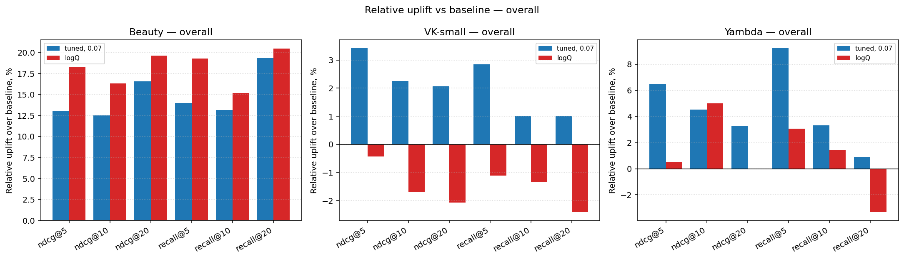

### Improvements over baseline — Cold items

**Beauty**
| variant     | metric    |   baseline |   value |   abs_uplift | rel_uplift_%   |
|-------------|-----------|------------|---------|--------------|----------------|
| tuned, 0.07 | ndcg@5    |    0.00904 | 0.01061 |     0.001569 | +17.36%        |
| tuned, 0.07 | ndcg@10   |    0.01066 | 0.01299 |     0.002324 | +21.80%        |
| tuned, 0.07 | ndcg@20   |    0.01311 | 0.01663 |     0.003519 | +26.84%        |
| tuned, 0.07 | recall@5  |    0.01263 | 0.01583 |     0.003202 | +25.35%        |
| tuned, 0.07 | recall@10 |    0.01779 | 0.02331 |     0.005515 | +31.00%        |
| tuned, 0.07 | recall@20 |    0.02811 | 0.03789 |     0.009785 | +34.81%        |
| logQ        | ndcg@5    |    0.00904 | 0.01217 |     0.003131 | +34.64%        |
| logQ        | ndcg@10   |    0.01066 | 0.01556 |     0.004898 | +45.94%        |
| logQ        | ndcg@20   |    0.01311 | 0.01953 |     0.006419 | +48.96%        |
| logQ        | recall@5  |    0.01263 | 0.01779 |     0.005159 | +40.85%        |
| logQ        | recall@10 |    0.01779 | 0.02864 |     0.01085  | +61.00%        |
| logQ        | recall@20 |    0.02811 | 0.0443  |     0.01619  | +57.59%        |

**VK-small**
| variant     | metric    |   baseline |    value |   abs_uplift | rel_uplift_%   |
|-------------|-----------|------------|----------|--------------|----------------|
| tuned, 0.07 | ndcg@5    |   0.002747 | 0.002091 |   -0.0006563 | -23.89%        |
| tuned, 0.07 | ndcg@10   |   0.003726 | 0.003072 |   -0.0006545 | -17.56%        |
| tuned, 0.07 | ndcg@20   |   0.005415 | 0.004735 |   -0.0006799 | -12.56%        |
| tuned, 0.07 | recall@5  |   0.005226 | 0.003996 |   -0.00123   | -23.53%        |
| tuned, 0.07 | recall@10 |   0.009222 | 0.00707  |   -0.002152  | -23.33%        |
| tuned, 0.07 | recall@20 |   0.01599  | 0.01383  |   -0.002152  | -13.46%        |
| logQ        | ndcg@5    |   0.002747 | 0.002957 |    0.0002096 | +7.63%         |
| logQ        | ndcg@10   |   0.003726 | 0.004817 |    0.001091  | +29.27%        |
| logQ        | ndcg@20   |   0.005415 | 0.00688  |    0.001465  | +27.06%        |
| logQ        | recall@5  |   0.005226 | 0.005533 |    0.0003074 | +5.88%         |
| logQ        | recall@10 |   0.009222 | 0.01137  |    0.002152  | +23.33%        |
| logQ        | recall@20 |   0.01599  | 0.02029  |    0.004304  | +26.92%        |

**Yambda**
| variant     | metric    |   baseline |    value |   abs_uplift | rel_uplift_%   |
|-------------|-----------|------------|----------|--------------|----------------|
| tuned, 0.07 | ndcg@5    |   0.002379 | 0.0015   |   -0.0008787 | -36.94%        |
| tuned, 0.07 | ndcg@10   |   0.003076 | 0.002074 |   -0.001001  | -32.56%        |
| tuned, 0.07 | ndcg@20   |   0.004131 | 0.003315 |   -0.0008151 | -19.73%        |
| tuned, 0.07 | recall@5  |   0.003885 | 0.002331 |   -0.001554  | -40.00%        |
| tuned, 0.07 | recall@10 |   0.008547 | 0.005439 |   -0.003108  | -36.36%        |
| tuned, 0.07 | recall@20 |   0.01321  | 0.009324 |   -0.003885  | -29.41%        |
| logQ        | ndcg@5    |   0.002379 | 0.001656 |   -0.0007231 | -30.40%        |
| logQ        | ndcg@10   |   0.003076 | 0.002026 |   -0.001049  | -34.12%        |
| logQ        | ndcg@20   |   0.004131 | 0.00324  |   -0.0008906 | -21.56%        |
| logQ        | recall@5  |   0.003885 | 0.002331 |   -0.001554  | -40.00%        |
| logQ        | recall@10 |   0.008547 | 0.005439 |   -0.003108  | -36.36%        |
| logQ        | recall@20 |   0.01321  | 0.0101   |   -0.003108  | -23.53%        |

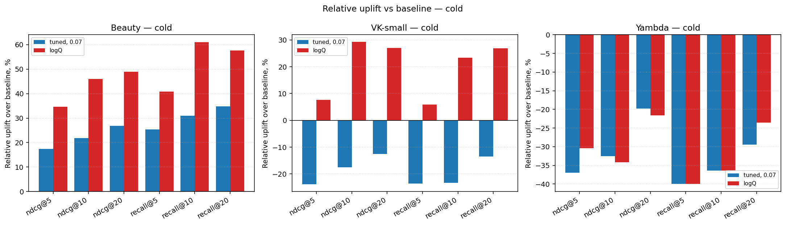

### Improvements over baseline — Warm items

**Beauty**
| variant     | metric    |   baseline |   value |   abs_uplift | rel_uplift_%   |
|-------------|-----------|------------|---------|--------------|----------------|
| tuned, 0.07 | ndcg@5    |    0.01263 | 0.01391 |     0.001275 | +10.10%        |
| tuned, 0.07 | ndcg@10   |    0.01497 | 0.01733 |     0.002365 | +15.80%        |
| tuned, 0.07 | ndcg@20   |    0.01808 | 0.0224  |     0.004312 | +23.84%        |
| tuned, 0.07 | recall@5  |    0.01789 | 0.02063 |     0.002744 | +15.34%        |
| tuned, 0.07 | recall@10 |    0.02541 | 0.03151 |     0.006098 | +24.00%        |
| tuned, 0.07 | recall@20 |    0.03862 | 0.05204 |     0.01342  | +34.74%        |
| logQ        | ndcg@5    |    0.01263 | 0.01588 |     0.003249 | +25.72%        |
| logQ        | ndcg@10   |    0.01497 | 0.01993 |     0.004961 | +33.15%        |
| logQ        | ndcg@20   |    0.01808 | 0.02453 |     0.006447 | +35.65%        |
| logQ        | recall@5  |    0.01789 | 0.02246 |     0.004574 | +25.57%        |
| logQ        | recall@10 |    0.02541 | 0.03608 |     0.01067  | +42.00%        |
| logQ        | recall@20 |    0.03862 | 0.0561  |     0.01748  | +45.26%        |

**VK-small**
| variant     | metric    |   baseline |    value |   abs_uplift | rel_uplift_%   |
|-------------|-----------|------------|----------|--------------|----------------|
| tuned, 0.07 | ndcg@5    |   0.00391  | 0.003864 |   -4.69e-05  | -1.20%         |
| tuned, 0.07 | ndcg@10   |   0.006013 | 0.005791 |   -0.0002221 | -3.69%         |
| tuned, 0.07 | ndcg@20   |   0.008409 | 0.008327 |   -8.172e-05 | -0.97%         |
| tuned, 0.07 | recall@5  |   0.006745 | 0.006452 |   -0.0002933 | -4.35%         |
| tuned, 0.07 | recall@10 |   0.01305  | 0.01246  |   -0.0005865 | -4.49%         |
| tuned, 0.07 | recall@20 |   0.02317  | 0.02258  |   -0.0005865 | -2.53%         |
| logQ        | ndcg@5    |   0.00391  | 0.003924 |    1.312e-05 | +0.34%         |
| logQ        | ndcg@10   |   0.006013 | 0.005719 |   -0.0002937 | -4.89%         |
| logQ        | ndcg@20   |   0.008409 | 0.008667 |    0.0002576 | +3.06%         |
| logQ        | recall@5  |   0.006745 | 0.006598 |   -0.0001466 | -2.17%         |
| logQ        | recall@10 |   0.01305  | 0.01261  |   -0.0004399 | -3.37%         |
| logQ        | recall@20 |   0.02317  | 0.02566  |    0.002493  | +10.76%        |

**Yambda**
| variant     | metric    |   baseline |    value |   abs_uplift | rel_uplift_%   |
|-------------|-----------|------------|----------|--------------|----------------|
| tuned, 0.07 | ndcg@5    |   0.002961 | 0.002647 |   -0.0003147 | -10.63%        |
| tuned, 0.07 | ndcg@10   |   0.003431 | 0.003646 |    0.0002149 | +6.26%         |
| tuned, 0.07 | ndcg@20   |   0.0048   | 0.005158 |    0.0003582 | +7.46%         |
| tuned, 0.07 | recall@5  |   0.00443  | 0.004833 |    0.0004027 | +9.09%         |
| tuned, 0.07 | recall@10 |   0.008458 | 0.008055 |   -0.0004027 | -4.76%         |
| tuned, 0.07 | recall@20 |   0.0141   | 0.0141   |    0         | +0.00%         |
| logQ        | ndcg@5    |   0.002961 | 0.003392 |    0.0004309 | +14.55%        |
| logQ        | ndcg@10   |   0.003431 | 0.004162 |    0.0007311 | +21.31%        |
| logQ        | ndcg@20   |   0.0048   | 0.006    |    0.001199  | +24.99%        |
| logQ        | recall@5  |   0.00443  | 0.005236 |    0.0008055 | +18.18%        |
| logQ        | recall@10 |   0.008458 | 0.007652 |   -0.0008055 | -9.52%         |
| logQ        | recall@20 |   0.0141   | 0.01611  |    0.002014  | +14.29%        |

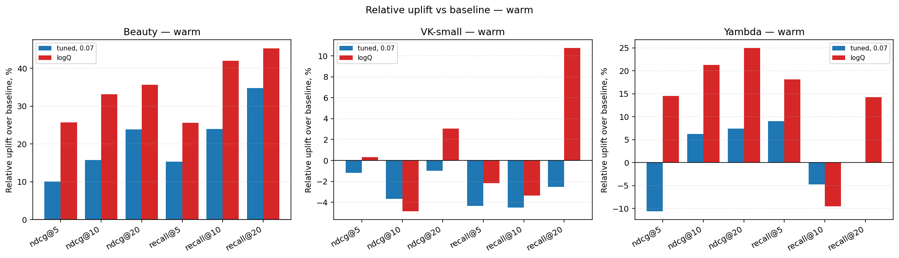

### Improvements over baseline — Hot items

**Beauty**
| variant     | metric    |   baseline |   value |   abs_uplift | rel_uplift_%   |
|-------------|-----------|------------|---------|--------------|----------------|
| tuned, 0.07 | ndcg@5    |    0.03204 | 0.03647 |     0.004426 | +13.81%        |
| tuned, 0.07 | ndcg@10   |    0.04061 | 0.04592 |     0.005304 | +13.06%        |
| tuned, 0.07 | ndcg@20   |    0.04813 | 0.05618 |     0.008057 | +16.74%        |
| tuned, 0.07 | recall@5  |    0.04858 | 0.05565 |     0.007078 | +14.57%        |
| tuned, 0.07 | recall@10 |    0.07527 | 0.08521 |     0.009942 | +13.21%        |
| tuned, 0.07 | recall@20 |    0.1062  | 0.1267  |     0.02042  | +19.23%        |
| logQ        | ndcg@5    |    0.03204 | 0.03801 |     0.005961 | +18.60%        |
| logQ        | ndcg@10   |    0.04061 | 0.04724 |     0.006623 | +16.31%        |
| logQ        | ndcg@20   |    0.04813 | 0.05736 |     0.009228 | +19.17%        |
| logQ        | recall@5  |    0.04858 | 0.05809 |     0.00951  | +19.58%        |
| logQ        | recall@10 |    0.07527 | 0.08656 |     0.01129  | +15.00%        |
| logQ        | recall@20 |    0.1062  | 0.1268  |     0.02059  | +19.38%        |

**VK-small**
| variant     | metric    |   baseline |   value |   abs_uplift | rel_uplift_%   |
|-------------|-----------|------------|---------|--------------|----------------|
| tuned, 0.07 | ndcg@5    |    0.06504 | 0.06727 |    0.002225  | +3.42%         |
| tuned, 0.07 | ndcg@10   |    0.08174 | 0.08359 |    0.001846  | +2.26%         |
| tuned, 0.07 | ndcg@20   |    0.09932 | 0.1014  |    0.002055  | +2.07%         |
| tuned, 0.07 | recall@5  |    0.09838 | 0.1012  |    0.002808  | +2.85%         |
| tuned, 0.07 | recall@10 |    0.1503  | 0.1518  |    0.001522  | +1.01%         |
| tuned, 0.07 | recall@20 |    0.2203  | 0.2225  |    0.002208  | +1.00%         |
| logQ        | ndcg@5    |    0.06504 | 0.06476 |   -0.0002823 | -0.43%         |
| logQ        | ndcg@10   |    0.08174 | 0.08036 |   -0.001382  | -1.69%         |
| logQ        | ndcg@20   |    0.09932 | 0.09725 |   -0.002063  | -2.08%         |
| logQ        | recall@5  |    0.09838 | 0.09728 |   -0.001093  | -1.11%         |
| logQ        | recall@10 |    0.1503  | 0.1482  |   -0.002036  | -1.35%         |
| logQ        | recall@20 |    0.2203  | 0.2149  |   -0.005401  | -2.45%         |

**Yambda**
| variant     | metric    |   baseline |   value |   abs_uplift | rel_uplift_%   |
|-------------|-----------|------------|---------|--------------|----------------|
| tuned, 0.07 | ndcg@5    |    0.01335 | 0.01421 |    0.0008623 | +6.46%         |
| tuned, 0.07 | ndcg@10   |    0.01703 | 0.01779 |    0.0007604 | +4.47%         |
| tuned, 0.07 | ndcg@20   |    0.0218  | 0.02246 |    0.0006632 | +3.04%         |
| tuned, 0.07 | recall@5  |    0.02092 | 0.02269 |    0.00177   | +8.46%         |
| tuned, 0.07 | recall@10 |    0.0338  | 0.03477 |    0.0009657 | +2.86%         |
| tuned, 0.07 | recall@20 |    0.05311 | 0.05344 |    0.0003219 | +0.61%         |
| logQ        | ndcg@5    |    0.01335 | 0.01342 |    6.788e-05 | +0.51%         |
| logQ        | ndcg@10   |    0.01703 | 0.01788 |    0.0008549 | +5.02%         |
| logQ        | ndcg@20   |    0.0218  | 0.02175 |   -4.398e-05 | -0.20%         |
| logQ        | recall@5  |    0.02092 | 0.02157 |    0.0006438 | +3.08%         |
| logQ        | recall@10 |    0.0338  | 0.03428 |    0.0004829 | +1.43%         |
| logQ        | recall@20 |    0.05311 | 0.05134 |   -0.00177   | -3.33%         |

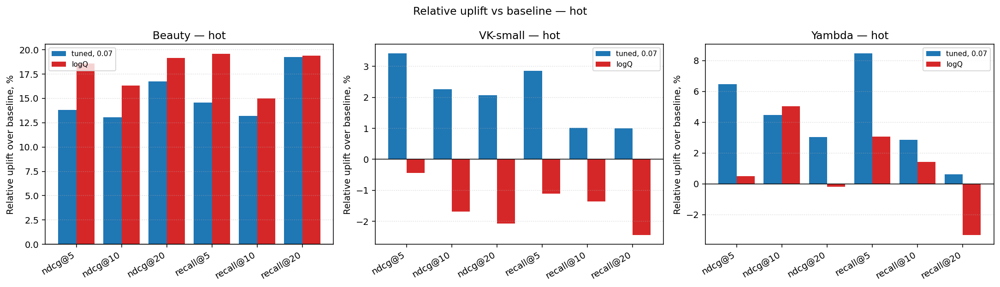

## logQ vs tuned, 0.07 — uplift per segment

### logQ vs tuned, 0.07 — Overall

**Beauty**
| metric    |   tuned, 0.07 |    logQ |   abs_uplift | rel_uplift_%   |
|-----------|---------------|---------|--------------|----------------|
| ndcg@5    |       0.03041 | 0.0318  |     0.001388 | +4.56%         |
| ndcg@10   |       0.03839 | 0.03968 |     0.001292 | +3.37%         |
| ndcg@20   |       0.04703 | 0.04827 |     0.001239 | +2.63%         |
| recall@5  |       0.04655 | 0.0487  |     0.002146 | +4.61%         |
| recall@10 |       0.07164 | 0.07293 |     0.001297 | +1.81%         |
| recall@20 |       0.1061  | 0.1071  |     0.001028 | +0.97%         |

**VK-small**
| metric    |   tuned, 0.07 |    logQ |   abs_uplift | rel_uplift_%   |
|-----------|---------------|---------|--------------|----------------|
| ndcg@5    |       0.06436 | 0.06196 |    -0.002399 | -3.73%         |
| ndcg@10   |       0.07998 | 0.07689 |    -0.003089 | -3.86%         |
| ndcg@20   |       0.097   | 0.09307 |    -0.003925 | -4.05%         |
| recall@5  |       0.09681 | 0.09308 |    -0.003732 | -3.86%         |
| recall@10 |       0.1452  | 0.1419  |    -0.003363 | -2.32%         |
| recall@20 |       0.213   | 0.2057  |    -0.007218 | -3.39%         |

**Yambda**
| metric    |   tuned, 0.07 |    logQ |   abs_uplift | rel_uplift_%   |
|-----------|---------------|---------|--------------|----------------|
| ndcg@5    |       0.01331 | 0.01257 |   -0.0007442 | -5.59%         |
| ndcg@10   |       0.01667 | 0.01675 |    7.639e-05 | +0.46%         |
| ndcg@20   |       0.02109 | 0.02042 |   -0.0006731 | -3.19%         |
| recall@5  |       0.02141 | 0.0202  |   -0.001206  | -5.63%         |
| recall@10 |       0.03272 | 0.03211 |   -0.000603  | -1.84%         |
| recall@20 |       0.0502  | 0.04809 |   -0.002111  | -4.20%         |

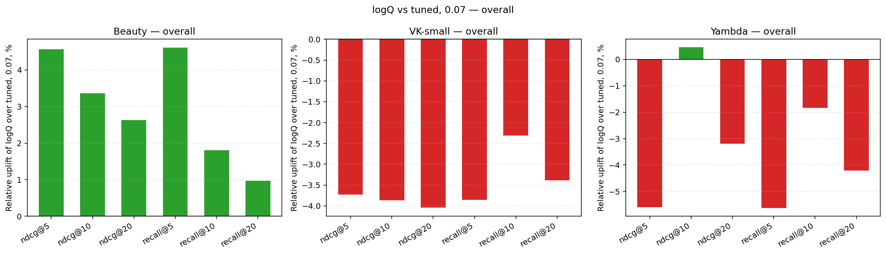

### logQ vs tuned, 0.07 — Cold items

**Beauty**
| metric    |   tuned, 0.07 |    logQ |   abs_uplift | rel_uplift_%   |
|-----------|---------------|---------|--------------|----------------|
| ndcg@5    |       0.01061 | 0.01217 |     0.001562 | +14.72%        |
| ndcg@10   |       0.01299 | 0.01556 |     0.002574 | +19.82%        |
| ndcg@20   |       0.01663 | 0.01953 |     0.0029   | +17.44%        |
| recall@5  |       0.01583 | 0.01779 |     0.001957 | +12.36%        |
| recall@10 |       0.02331 | 0.02864 |     0.005337 | +22.90%        |
| recall@20 |       0.03789 | 0.0443  |     0.006405 | +16.90%        |

**VK-small**
| metric    |   tuned, 0.07 |     logQ |   abs_uplift | rel_uplift_%   |
|-----------|---------------|----------|--------------|----------------|
| ndcg@5    |      0.002091 | 0.002957 |     0.000866 | +41.41%        |
| ndcg@10   |      0.003072 | 0.004817 |     0.001745 | +56.82%        |
| ndcg@20   |      0.004735 | 0.00688  |     0.002145 | +45.31%        |
| recall@5  |      0.003996 | 0.005533 |     0.001537 | +38.46%        |
| recall@10 |      0.00707  | 0.01137  |     0.004304 | +60.87%        |
| recall@20 |      0.01383  | 0.02029  |     0.006456 | +46.67%        |

**Yambda**
| metric    |   tuned, 0.07 |     logQ |   abs_uplift | rel_uplift_%   |
|-----------|---------------|----------|--------------|----------------|
| ndcg@5    |      0.0015   | 0.001656 |    0.0001556 | +10.37%        |
| ndcg@10   |      0.002074 | 0.002026 |   -4.793e-05 | -2.31%         |
| ndcg@20   |      0.003315 | 0.00324  |   -7.555e-05 | -2.28%         |
| recall@5  |      0.002331 | 0.002331 |    0         | +0.00%         |
| recall@10 |      0.005439 | 0.005439 |    0         | +0.00%         |
| recall@20 |      0.009324 | 0.0101   |    0.000777  | +8.33%         |

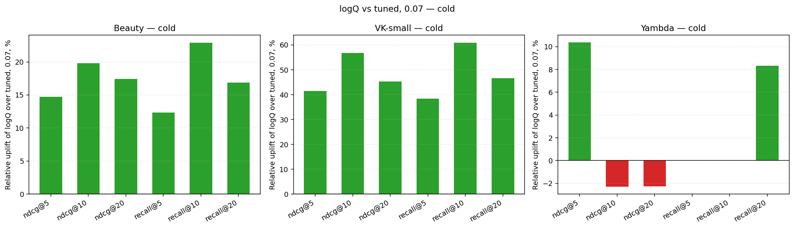

### logQ vs tuned, 0.07 — Warm items

**Beauty**
| metric    |   tuned, 0.07 |    logQ |   abs_uplift | rel_uplift_%   |
|-----------|---------------|---------|--------------|----------------|
| ndcg@5    |       0.01391 | 0.01588 |     0.001973 | +14.19%        |
| ndcg@10   |       0.01733 | 0.01993 |     0.002596 | +14.98%        |
| ndcg@20   |       0.0224  | 0.02453 |     0.002135 | +9.53%         |
| recall@5  |       0.02063 | 0.02246 |     0.001829 | +8.87%         |
| recall@10 |       0.03151 | 0.03608 |     0.004574 | +14.52%        |
| recall@20 |       0.05204 | 0.0561  |     0.004065 | +7.81%         |

**VK-small**
| metric    |   tuned, 0.07 |     logQ |   abs_uplift | rel_uplift_%   |
|-----------|---------------|----------|--------------|----------------|
| ndcg@5    |      0.003864 | 0.003924 |    6.002e-05 | +1.55%         |
| ndcg@10   |      0.005791 | 0.005719 |   -7.168e-05 | -1.24%         |
| ndcg@20   |      0.008327 | 0.008667 |    0.0003393 | +4.08%         |
| recall@5  |      0.006452 | 0.006598 |    0.0001466 | +2.27%         |
| recall@10 |      0.01246  | 0.01261  |    0.0001466 | +1.18%         |
| recall@20 |      0.02258  | 0.02566  |    0.003079  | +13.64%        |

**Yambda**
| metric    |   tuned, 0.07 |     logQ |   abs_uplift | rel_uplift_%   |
|-----------|---------------|----------|--------------|----------------|
| ndcg@5    |      0.002647 | 0.003392 |    0.0007456 | +28.17%        |
| ndcg@10   |      0.003646 | 0.004162 |    0.0005161 | +14.16%        |
| ndcg@20   |      0.005158 | 0.006    |    0.0008412 | +16.31%        |
| recall@5  |      0.004833 | 0.005236 |    0.0004027 | +8.33%         |
| recall@10 |      0.008055 | 0.007652 |   -0.0004027 | -5.00%         |
| recall@20 |      0.0141   | 0.01611  |    0.002014  | +14.29%        |

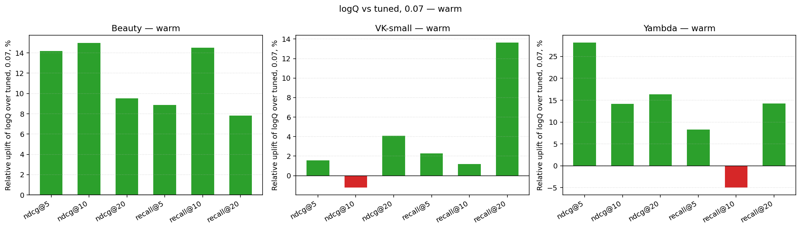

### logQ vs tuned, 0.07 — Hot items

**Beauty**
| metric    |   tuned, 0.07 |    logQ |   abs_uplift | rel_uplift_%   |
|-----------|---------------|---------|--------------|----------------|
| ndcg@5    |       0.03647 | 0.03801 |    0.001535  | +4.21%         |
| ndcg@10   |       0.04592 | 0.04724 |    0.001319  | +2.87%         |
| ndcg@20   |       0.05618 | 0.05736 |    0.001171  | +2.08%         |
| recall@5  |       0.05565 | 0.05809 |    0.002432  | +4.37%         |
| recall@10 |       0.08521 | 0.08656 |    0.001351  | +1.59%         |
| recall@20 |       0.1267  | 0.1268  |    0.0001621 | +0.13%         |

**VK-small**
| metric    |   tuned, 0.07 |    logQ |   abs_uplift | rel_uplift_%   |
|-----------|---------------|---------|--------------|----------------|
| ndcg@5    |       0.06727 | 0.06476 |    -0.002508 | -3.73%         |
| ndcg@10   |       0.08359 | 0.08036 |    -0.003228 | -3.86%         |
| ndcg@20   |       0.1014  | 0.09725 |    -0.004119 | -4.06%         |
| recall@5  |       0.1012  | 0.09728 |    -0.003901 | -3.86%         |
| recall@10 |       0.1518  | 0.1482  |    -0.003558 | -2.34%         |
| recall@20 |       0.2225  | 0.2149  |    -0.007609 | -3.42%         |

**Yambda**
| metric    |   tuned, 0.07 |    logQ |   abs_uplift | rel_uplift_%   |
|-----------|---------------|---------|--------------|----------------|
| ndcg@5    |       0.01421 | 0.01342 |   -0.0007945 | -5.59%         |
| ndcg@10   |       0.01779 | 0.01788 |    9.443e-05 | +0.53%         |
| ndcg@20   |       0.02246 | 0.02175 |   -0.0007072 | -3.15%         |
| recall@5  |       0.02269 | 0.02157 |   -0.001127  | -4.96%         |
| recall@10 |       0.03477 | 0.03428 |   -0.0004829 | -1.39%         |
| recall@20 |       0.05344 | 0.05134 |   -0.002092  | -3.92%         |

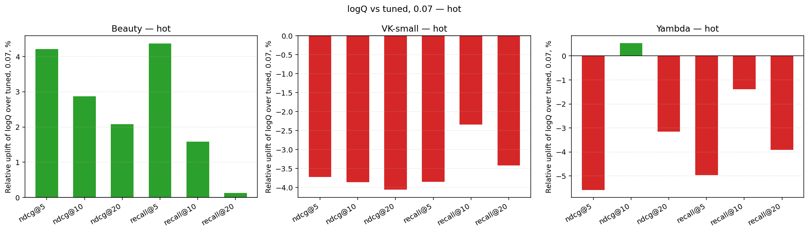

